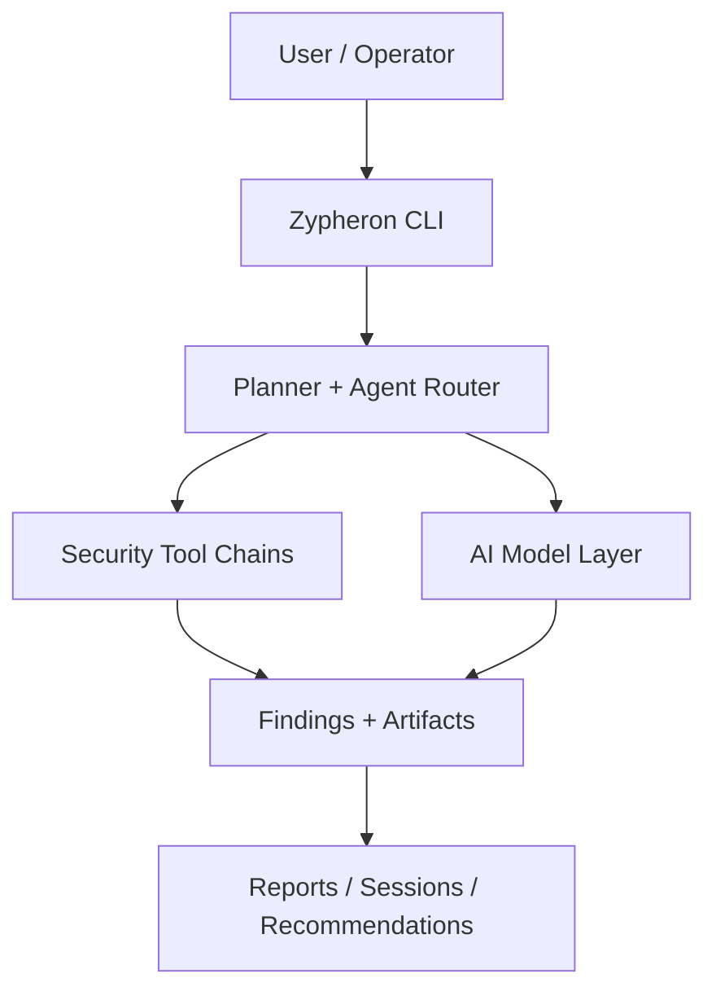

<div align="center">
  <h1>Zypheron CLI</h1>
  <h3>AI-Powered Penetration Testing Platform</h3>

  <p>
    <a href="https://go.dev/"></a>
    <a href="https://www.python.org/"></a>
    <a href="LICENSE"></a>
    <a href="#integrated-tools"></a>
    <a href="#ai-providers"></a>
  </p>

  <p>AI-native pentesting CLI with autonomous orchestration, custom tooling flows, and multi-model intelligence.</p>

  <!-- TODO: Replace with actual asciinema recording
  <a href="https://asciinema.org/a/YOUR_RECORDING_ID">
    
  </a>
  -->

  <p><a href="CHANGELOG.md">What's New</a> • <a href="#architecture-overview">Architecture</a> • <a href="docs/INSTALL.md">Installation</a> • <a href="#features">Features</a> • <a href="#ai-providers">AI Providers</a> • <a href="docs/MCP_INTEGRATION.md">API/MCP</a></p>
</div>

---

## Follow Us

[](https://discord.gg/)
[](https://www.linkedin.com/)

## Architecture Overview

Zypheron combines command orchestration, tool-chain automation, and AI-native analysis in one CLI.



## Quick Start

```bash
# Clone and run the bootstrap
git clone -b Zypheron-CLI https://github.com/KKingZero/Cobra-AI.git
cd Cobra-AI
bash ./setup-hybrid.sh
```

That bootstrap builds the CLI, installs Python dependencies, configures shell completion, and can install the critical toolchain in one pass.

## Features

- Fast single binary with minimal runtime overhead
- 50+ integrated offensive and defensive security tools
- AI agent orchestration for autonomous scan planning and execution
- Runtime model switching from TUI for multi-provider workflows
- AutoPent session save/resume for long engagements
- CVE enrichment from multiple public sources
- Cross-platform operation on Linux, macOS, and WSL
- **Bug bounty mode** with scope parsing and submission draft generation
- **Cloud security** scanning (AWS, Azure, GCP, K8s)
- **Active Directory** kill-chain with approval gates
- **MITRE ATT&CK** objective-driven attack execution
- Structured report export and session artifacts

## Benchmark Results

> AutoPent performance on HackTheBox machines. All runs use default settings with Claude as the AI provider.

| Machine | Difficulty | Time | Tools Used | Findings | Root |
|---------|-----------|------|------------|----------|------|
| _Placeholder_ | Easy | _TBD_ | nmap, gobuster, nuclei, sqlmap | _TBD_ | _TBD_ |
| _Placeholder_ | Medium | _TBD_ | nmap, ffuf, nikto, metasploit | _TBD_ | _TBD_ |
| _Placeholder_ | Hard | _TBD_ | nmap, bloodhound, impacket, certipy | _TBD_ | _TBD_ |

> Run your own benchmarks: `zypheron autopent <target> --save-session` and results are logged to `~/.zypheron/loot/<session>/timeline.log`

## Documentation

| Guide | Description |
|---|---|
| [Installation](docs/INSTALL.md) | Full installation options |
| [Setup & Usage](docs/SETUP_AND_USE.md) | Configuration and practical usage |
| [Go CLI Reference](docs/GO_GUIDE.md) | Command-level reference |
| [AI Features](docs/AI_GUIDE.md) | Providers, keys, and model behavior |
| [MCP Integration](docs/MCP_INTEGRATION.md) | Agent/tool bridge integration |
| [Tool Chains](docs/TOOL_CHAINS.md) | Automated chain workflows |
| [Troubleshooting](HELP.md) | Common issues and fixes |

## Common Commands

```bash
# TUI
zypheron
zypheron tui

# Scanning
zypheron scan example.com
zypheron scan example.com --web
zypheron scan example.com --ai-guided

# Autonomous pentest
zypheron autopent example.com
zypheron autopent --resume session.json

# Bug bounty mode
zypheron bounty --scope scope.txt --platform hackerone
zypheron bounty example.com --auto

# Cloud security
zypheron cloud --provider aws --target <account>
zypheron cloud --provider azure --target <tenant>
zypheron cloud check

# Active Directory
zypheron ad --target 10.10.10.1 --domain corp.local
zypheron ad --target 10.10.10.1 --domain corp.local --mode enum
zypheron ad check

# MITRE ATT&CK
zypheron mitre run --objective "Initial Access" --target 10.10.10.1
zypheron mitre run --objective "Credential Access" --target 10.10.10.1
zypheron mitre list
zypheron mitre update

# Reports
zypheron report --session <id> --format md
zypheron report --session <id> --format pdf --output report.pdf

# AI chat
zypheron chat "How do I test for SQLi?"

# Recon / OSINT
zypheron recon example.com
zypheron osint subdomain example.com
```

## Integrated Tools

| Category | Tools |
|---|---|
| Scanning | nmap, masscan, nuclei |
| Web | nikto, sqlmap, gobuster, ffuf, feroxbuster, dirsearch, wfuzz, dirb, whatweb, wpscan |
| Web Recon | httpx, katana, gau, waybackurls, assetfinder |
| API | kiterunner, newman, schemathesis, jwt-tool |
| Password | hydra, john, hashcat |
| Recon | subfinder, amass, theharvester, sublist3r |
| Frameworks | metasploit |
| C2 | sliver, covenant, empire |
| AD | bloodhound, netexec, impacket, certipy, responder, mimikatz, lsassy, snaffler |
| Cloud | prowler, pacu, scoutsuite, cloudbrute, trivy, kube-hunter, checkov |
| Wireless | aircrack-ng |
| RE/Pwn | radare2, gdb, ghidra, pwntools, checksec |
| Forensics | volatility, sleuthkit, binwalk |

## AI Providers

| Provider | Default Model | Fallback |
|---|---|---|
| Anthropic Claude | claude-opus-4-6 | claude-sonnet-4-6 |
| OpenAI | gpt-5.4 | gpt-5.2 |
| Google Gemini | gemini-3.1-pro-preview | gemini-3-flash-preview |
| DeepSeek | deepseek-r1 | deepseek-chat |
| Moonshot Kimi | kimi-k2 | moonshot-v1-128k |
| Ollama (local) | qwen3-coder | llama3.2:3b, mistral:latest, any local model |

## Loot Directory Structure

All session data is logged locally to `~/.zypheron/loot/<session-id>/`:

```
session.json        # Session metadata
timeline.log        # JSONL timeline of all actions
ports/              # Port scan results
services/           # Service enumeration
hosts/              # Discovered hosts
creds/              # Captured credentials
vulns/              # Vulnerability findings
findings/           # General findings
screenshots/        # Visual evidence
web/                # Web application data
cloud/              # Cloud scan results
ad/                 # Active Directory data
attack/             # MITRE ATT&CK execution logs
reports/            # Generated reports
raw/                # Raw tool output
```

## Requirements

- Go `1.24+`
- Python `3.9+`
- Linux/macOS/WSL (Kali recommended)

For heavy AI workflows, see `zypheron-ai/install-heavy.sh`.

## Legal

For authorized security testing only. Always obtain written permission before scanning systems.

## License

MIT License. See [LICENSE](LICENSE).
